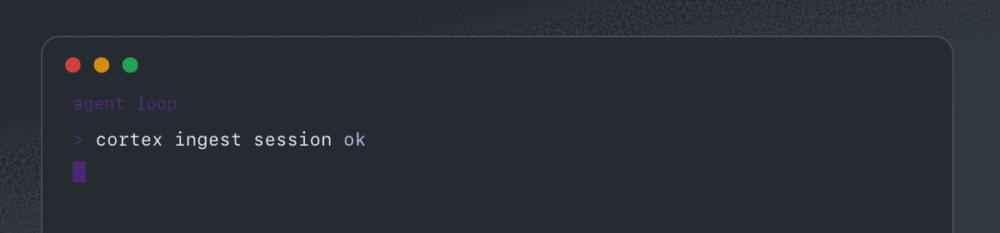

  
  
  

## About

Building AI tools and systems that hold up in daily use! 

**Building now:** [cortex](https://github.com/AdityaVG13/cortex) · [gpr](https://github.com/AdityaVG13/gpr) · [Model-Switchboard](https://github.com/AdityaVG13/Model-Switchboard)

## Start Here

If you are exploring agent tooling or inference, these are the main repos.

### [Cortex](https://github.com/AdityaVG13/cortex)

Persistent shared memory and context compression for AI coding agents. Rust daemon with HTTP, MCP, and a desktop control center.

`Rust` · `MCP` · `agent memory`

### [Model Switchboard](https://github.com/AdityaVG13/Model-Switchboard)

Model routing for Mac. Pick models and switch quickly across local and hosted backends.

`Python` · `model routing` · `Mac`

### [gpr](https://github.com/AdityaVG13/gpr)

Goal-driven PRD ratchet for agent workflows. Work stays open until real artifacts pass checks.

`Python` · `spec-driven` · `agent workflows`

## Also Open Source

| Project | What it is |
| :--- | :--- |
| [RustLibraries](https://github.com/AdityaVG13/RustLibraries) | Python libraries ported to Rust |
| [TweetKB](https://github.com/AdityaVG13/TweetKB) | Organize and analyze Twitter bookmarks |
| [TwitterArticles](https://github.com/AdityaVG13/TwitterArticles) | Chrome extension to download Twitter articles |

<strong>Inference workbenches</strong> (forks and experiments)

| Project | Notes |
| :--- | :--- |
| [llama.cpp](https://github.com/AdityaVG13/llama.cpp) | C/C++ LLM inference workbench |
| [lucebox-hub](https://github.com/AdityaVG13/lucebox-hub) | Hand-tuned inference for consumer hardware |
| [rvllm](https://github.com/AdityaVG13/rvllm) | Rust LLM inference / vLLM-style serving |
| [vllm](https://github.com/AdityaVG13/vllm) | High-throughput LLM serving |

## Working Style

- Use local, cloud, or hybrid setups depending on what the work needs.
- Prefer artifacts, tests, and clear completion checks over vibes.
- Move fast on experiments; move carefully on published work.
- Treat agent systems as infrastructure, not demos.

