# AdityaG

  

I build local-first AI tools, inference infrastructure, and Minecraft modding utilities. The through-line is practical systems work: make the loop observable, make the tooling faster, and keep enough structure that a project can survive real use.

  
  
  

## Start Here

<table>
  <tr>
    <td width="50%">
      <a href="https://github.com/AdityaVG13/cortex"><strong>Cortex</strong></a>
       
      Persistent shared memory and context compression for AI coding agents. Local-first Rust daemon with HTTP, MCP, and a desktop control center.
        
      Rust / local-first / MCP / memory / agent tooling
    </td>
    <td width="50%">
      <a href="https://github.com/AdityaVG13/Model-Switchboard"><strong>Model Switchboard</strong></a>
       
      Local Model Switchboard for Mac. Built around practical local model routing instead of dashboard theater.
        
      Python / local models / Mac tooling
    </td>
  </tr>
  <tr>
    <td width="50%">
      <a href="https://github.com/AdityaVG13/gpr"><strong>gpr</strong></a>
       
      Goal-driven PRD ratchet: an agent loop that only marks work done when real artifacts pass real checks.
        
      Python / Codex / Claude Code / spec-driven development
    </td>
    <td width="50%">
      <a href="https://github.com/AdityaVG13/Twist-Stuff"><strong>Twist-Stuff</strong></a>
       
      Twist Space quest books and modding information. The public anchor for the Minecraft side of the workbench.
        
      GTNH / quest books / modpack notes
    </td>
  </tr>
</table>

## Open Source Projects

| Project | What it is | Stack |
| --- | --- | --- |
| [Cortex](https://github.com/AdityaVG13/cortex) | Persistent shared memory and context compression for AI coding agents. | Rust |
| [Model Switchboard](https://github.com/AdityaVG13/Model-Switchboard) | Local Model Switchboard for Mac. | Python |
| [gpr](https://github.com/AdityaVG13/gpr) | Goal-driven PRD ratchet for agent workflows with real completion checks. | Python |
| [TweetKB](https://github.com/AdityaVG13/TweetKB) | Organize and analyze Twitter bookmarks. | Python |
| [TwitterArticles](https://github.com/AdityaVG13/TwitterArticles) | Chrome extension to download Twitter articles. | JavaScript |
| [RustLibraries](https://github.com/AdityaVG13/RustLibraries) | Python libraries ported to Rust. | Rust |

## AI And Tech Forks

| Project | Why it is here | Stack |
| --- | --- | --- |
| [llama.cpp](https://github.com/AdityaVG13/llama.cpp) | C and C++ LLM inference workbench. | C++ |
| [lucebox-hub](https://github.com/AdityaVG13/lucebox-hub) | Hand-tuned LLM inference for specific consumer hardware. | C++ |
| [rvllm](https://github.com/AdityaVG13/rvllm) | Rust LLM inference engine and vLLM-style serving experiment. | Rust |
| [vllm](https://github.com/AdityaVG13/vllm) | High-throughput LLM inference and serving engine. | Python |

## Minecraft Modding

| Project | Notes | Stack |
| --- | --- | --- |
| [Twist-Stuff](https://github.com/AdityaVG13/Twist-Stuff) | Twist Space quest books and reference material. | Docs |
| [Nomifactory-Scripts](https://github.com/AdityaVG13/Nomifactory-Scripts) | Multiblock scripts for Nomifactory CEu. | ZenScript |
| [123Technology](https://github.com/AdityaVG13/123Technology) | Minecraft technology mod project. | Java |
| [Applied-Energistics-2-Unofficial](https://github.com/AdityaVG13/Applied-Energistics-2-Unofficial) | Unofficial AE2 for Minecraft 1.7.10. | Java |
| [BetterQuesting](https://github.com/AdityaVG13/BetterQuesting) | Questing mod source. | Java |
| [ForestryCE](https://github.com/AdityaVG13/ForestryCE) | Forestry Community Edition source code. | Java |
| [ForestryMC](https://github.com/AdityaVG13/ForestryMC) | Forestry Minecraft mod source code. | Java |
| [GT-New-Horizons-Modpack](https://github.com/AdityaVG13/GT-New-Horizons-Modpack) | Progressive questing modpack for Minecraft 1.7.10 around GregTech. | Python |
| [GT-Not-Leisure](https://github.com/AdityaVG13/GT-Not-Leisure) | GTNH-oriented modding work. | Java |
| [GT5-Unofficial](https://github.com/AdityaVG13/GT5-Unofficial) | Decompiled and modified GT5.07.07 source. | Java |
| [Programmable-Hatches-Mod](https://github.com/AdityaVG13/Programmable-Hatches-Mod) | GTNH addon for programmable hatches. | Java |
| [time-crystal](https://github.com/AdityaVG13/time-crystal) | Replacement for the Minecraft 1.7.10 Torcherino mod. | Java |
| [Twist-Space-Technology-Mod](https://github.com/AdityaVG13/Twist-Space-Technology-Mod) | Late-game GTNH content and modded elements. | Java |

## Working Style

- Local-first when the machine can do the job.
- Evidence over vibes: artifacts, tests, and visible completion checks.
- Fast loops for AI tooling, careful loops for published work.
- Minecraft modding treated like systems engineering, not a pile of scripts.

## Links

- GitHub: [AdityaVG13](https://github.com/AdityaVG13)
- Link hub: [beacons.ai/adityavg13](https://beacons.ai/adityavg13)
